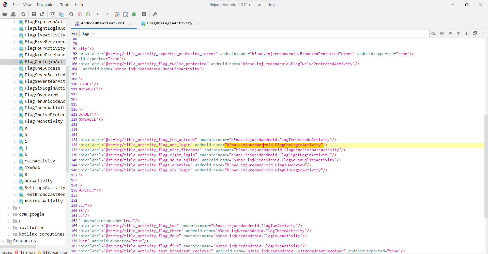
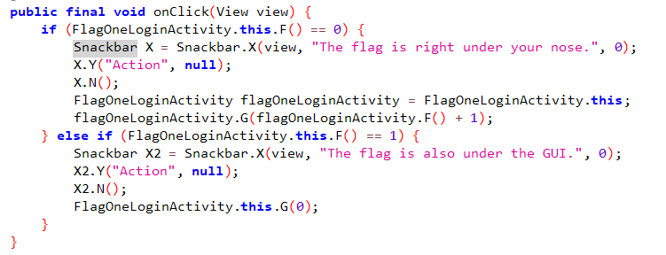
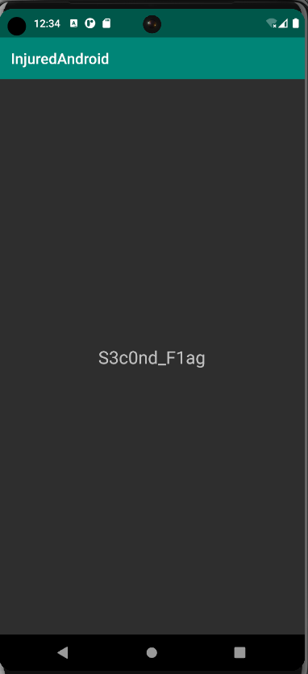
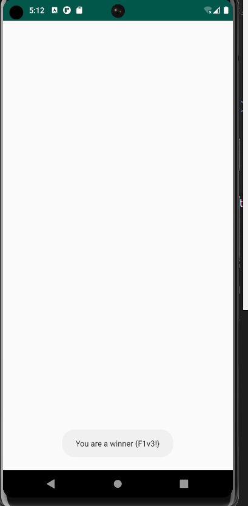
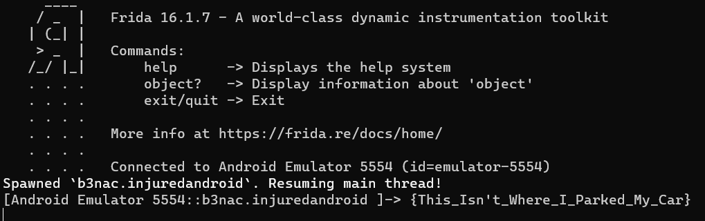
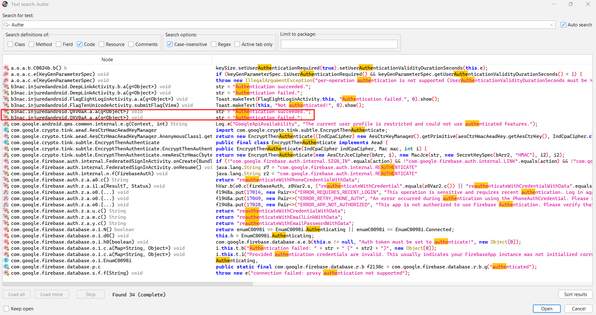
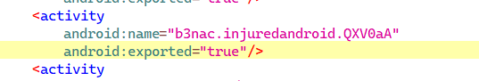
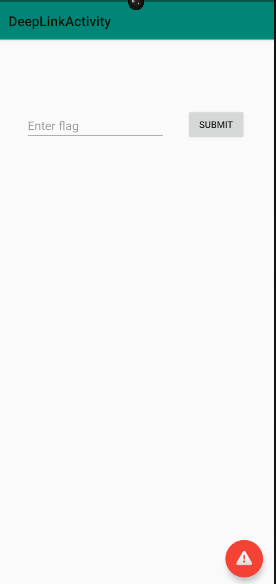
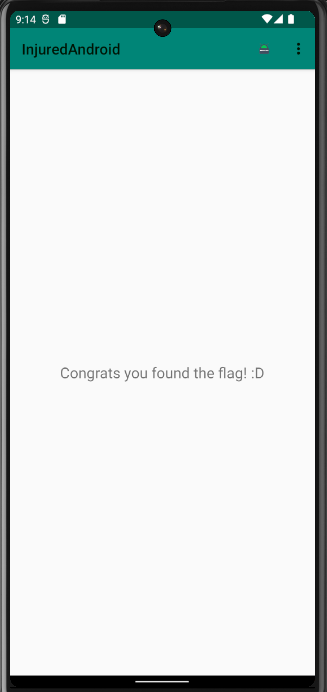

# <u>Solution</u>
First decompile the apk file using jadx-gui. Inside decompile all the classes under tools. Keep the AndroidManifest.xml file under Resources always open as it contains the activities that executes and is created.

## Challenge 1

Inside AndroidManifest.xml search for `FlagOneLoginActivity` as it is the activity that will be launched when you open the challenge.


Double click on that activity name and it will take you to the java code of `FlagOneLoginActivity`

You can observe this part where the hints have been written, which you can see on pressing the emergency looking button in the app.


Now we check the `submitFlag` function
```java
 public final void submitFlag(View view) {
        EditText editText = (EditText) findViewById(R.id.editText2);
        d.s.d.g.d(editText, "editText2");
        if (d.s.d.g.a(editText.getText().toString(), "F1ag_0n3")) // Here is the flag
        {
            Intent intent = new Intent(this, FlagOneSuccess.class);
            new FlagsOverview().J(true);
            new j().b(this, "flagOneButtonColor", true);
            startActivity(intent);
        }

```

From the hints it can be clearly made out that the flag is right infront of us. And we can clearly see the flag.

Flag:- `F1ag_0n3`

## Challenge 2

Exported Activities are activities that can be launched from outside of an app.

By looking at the code of `FlagTwoActivity` nothing is found there. So how do we proceed?? In the hints they asked to find for keywords '`exported` and `activity`. So we will go to `AndroidManifest.xml` and find the required activity.

On searching we find a line that looks interesting:
```xml
<activity android:name="b3nac.injuredandroid.b25lActivity" android:exported="true"/>
```
Here the activity name is `b3nac.injuredandroid.b25lActivity`.

Now to run this activity we will make use of `adb`

The command has a syntax:
`adb shell am start -n <package_name>/<activity_name>`
The package name can be easily got from the 1st line in `AndroidManifest.xml`.

Hence run this command on your terminal:
`adb shell am start -n b3nac.injuredandroid/b3nac.injuredandroid.b25lActivity`

It will give an output on the terminal as:
`Starting: Intent { cmp=b3nac.injuredandroid/.b25lActivity }`

Now on checking the injuredandroid app we find the flag on the screen. Hence an activity was launched from outside the app.


Flag: `S3c0nd_F1ag`

## Challenge 3

In the `submitFlag` file for this challenge, we see that our input is being compared with some value.
```java
public final void submitFlag(View view) {  
        EditText editText = (EditText) findViewById(R.id.editText2);  
        d.s.d.g.d(editText, "editText2");  
        if (d.s.d.g.a(editText.getText().toString(), getString(R.string.cmVzb3VyY2VzX3lv))) // Here
        {  
            Intent intent = new Intent(this, FlagOneSuccess.class);  
            new FlagsOverview().L(true);  
            new j().b(this, "flagThreeButtonColor", true);  
            startActivity(intent);  
        } 
    }
```

Now when we double click and go to the mentioned file and check the value, it shows an integer value in hexadecimal format.
```java
public static final int cmVzb3VyY2VzX3lv = 0x7f0f002f;
```

Doesn't really look like a flag.

So now what?? There is another folder named `resources.arsc`. Under that go to `res/values/strings.xml`. Here we search for the same variable and we get the flag.

```xml
<string name="cmVzb3VyY2VzX3lv">F1ag_thr33</string>
```

Flag: `F1ag_thr33`

`strings.xml` is a very lucrative place to look for vulnerabilities. Usernames and passwords might just be there in poorly secure apps.

## Challenge 4

As usual we 1st look into the Activity file for this challenge.

In the `submitFlag` function we see that `a2` array is getting its data from some external function of another class.
```java
public final void submitFlag(View view) {  
        EditText editText = (EditText) findViewById(R.id.editText2);  
        d.s.d.g.d(editText, "editText2");  
        String obj = editText.getText().toString();  
        byte[] a2 = new g().a();  // Here
        d.s.d.g.d(a2, "decoder.getData()");
        if (d.s.d.g.a(obj, new String(a2, d.w.c.f2418a))) {  
            Intent intent = new Intent(this, FlagOneSuccess.class);  
            new FlagsOverview().I(true);  
            new j().b(this, "flagFourButtonColor", true);  
            startActivity(intent);
        }  
    }
```

We go to the location by double clicking on it.

```java
package b3nac.injuredandroid; 
import android.util.Base64;  
/* loaded from: classes.dex */ 
public class g {  
    /* renamed from: a  reason: collision with root package name */  
    private byte[] f1468a = Base64.decode("NF9vdmVyZG9uZV9vbWVsZXRz", 0);  
    public byte[] a() {  
        return this.f1468a;  
    }  
}
```

It is clearly seen that `Base64.decode("NF9vdmVyZG9uZV9vbWVsZXRz")` is returned to `a2` array.
Use an online decoder for the given string and we get the flag.

Flag: `4_overdone_omelets`

## Challenge 5

In the `onCreate` function we see that `FlagFiveReceiver` class is called.
```java
new ComponentName(this, FlagFiveReceiver.class);
```

So we go to the following class and see the code there.
```java
package b3nac.injuredandroid;

import android.content.BroadcastReceiver;
import android.content.Context;
import android.content.Intent;
import android.util.Log;
import android.widget.Toast;
  
/* loaded from: classes.dex */
public final class FlagFiveReceiver extends BroadcastReceiver {
    /* renamed from: a  reason: collision with root package name */
    private static int f1454a;
    @Override // android.content.BroadcastReceiver
    public void onReceive(Context context, Intent intent) {
        String str;
        int i;
        String e;
        String e2;
        d.s.d.g.e(context, "context");
        d.s.d.g.e(intent, "intent");
        j.j.a(context);
        int i2 = f1454a;
        if (i2 == 0) {
            StringBuilder sb = new StringBuilder();
            e = d.w.h.e("\n    Action: " + intent.getAction() + "\n\n    ");
            sb.append(e);
            e2 = d.w.h.e("\n    URI: " + intent.toUri(1) + "\n\n    ");
            sb.append(e2);
            str = sb.toString();
            d.s.d.g.d(str, "sb.toString()");
            Log.d("DUDE!:", str);
        } else {
            str = "Keep trying!";
            if (i2 != 1) {
                if (i2 != 2) {
                    Toast.makeText(context, "Keep trying!", 1).show();
                    return;
                }
				new FlagsOverview().H(true);
				new j().b(context, "flagFiveButtonColor", true);
				Toast.makeText(context, "You are a winner " + k.a("Zkdlt0WwtLQ="), 1).show();
                i = 0;
                f1454a = i;
            }
        }
        Toast.makeText(context, str, 1).show();
        i = f1454a + 1;
        f1454a = i;
    } 
}
```
On analyzing this code it can be concluded that by clicking on the challenge 3 times, the decoded flag will be displayed on the screen.

Flag: {F1v3!}

## Challenge 6

We first check the `submitFlag` function in the `FlagSixLoginActivity` 
```java
 public final void submitFlag(View view) {
        EditText editText = (EditText) findViewById(R.id.editText3);
        d.s.d.g.d(editText, "editText3");
        if (d.s.d.g.a(editText.getText().toString(), k.a("k3FElEG9lnoWbOateGhj5pX6QsXRNJKh///8Jxi8KXW7iDpk2xRxhQ=="))) { 
            Intent intent = new Intent(this, FlagOneSuccess.class);
            FlagsOverview.G = true;
            new j().b(this, "flagSixButtonColor", true);
            startActivity(intent);
        }
  }
```
We see that `k3FElEG9lnoWbOateGhj5pX6QsXRNJKh///8Jxi8KXW7iDpk2xRxhQ==` is being passes to function `a` of class `k`. 

We can click and see what the function does 
```java
 public static String a(String str) {
        if (c(str)) {
            try {
                SecretKey generateSecret = SecretKeyFactory.getInstance("DES").generateSecret(new DESKeySpec(f1472a));
                byte[] decode = Base64.decode(str, 0);
                Cipher cipher = Cipher.getInstance("DES");
                cipher.init(2, generateSecret);
                return new String(cipher.doFinal(decode));
            } catch (InvalidKeyException | NoSuchAlgorithmException | InvalidKeySpecException | BadPaddingException | IllegalBlockSizeException | NoSuchPaddingException e) {
                e.printStackTrace();
            }
        } else {
            System.out.println("Not a string!");
        }
        return str;
    }
```
It takes a value from some other java file and does some decryption on the string provided.

Now you can write a custom java program to pass the string to this function and output the value. But this can be done if the function is this small and simple. A better way to do this to write a `frida script` for this.

You can see the full js script in [lvl_6.js](https://github.com/Joy2225/Rev_treasure/blob/main/Android/Injured_android/lvl_6.js) 
```js
Java.perform(function(){
    let a=Java.use("b3nac.injuredandroid.k"); // Class name k inside the package 
    var flag=a.a("k3FElEG9lnoWbOateGhj5pX6QsXRNJKh///8Jxi8KXW7iDpk2xRxhQ=="); //Calling the function a inside the class represented by a and storing and printing the flag
    console.log(flag);
})
```
First we are storing the class name inside package `b3nac.injuredandroid.k` and referring it to as `a`. Then we call the function `a` inside the class and pass the encoded string `k3FElEG9lnoWbOateGhj5pX6QsXRNJKh///8Jxi8KXW7iDpk2xRxhQ==` and store the result in `flag` and print the `flag`.

**Running the Frida script**
Firstly, run the `Frida-server`. If you don't know how to run it check out [Frida setup](https://github.com/Joy2225/Rev_treasure/blob/main/Android/Setup%20Frida.md)
Now open another terminal and go to the directory where you have the `js file` and type the following command:
```
frida -U -f b3nac.injuredandroid -l lvl_6.js
```

`b3nac.injuredandroid` is the package name and `lvl_6.js` is the `js script`
We get the output something like this


We get out flag.
Flag: `{This_Isn't_Where_I_Parked_My_Car}`


## Challenge 7

We see the `onCreate`  and `onDestroy` functions.
```java
public void onCreate(Bundle bundle) {
        super.onCreate(bundle);
        setContentView(R.layout.activity_flag_seven_sqlite);
        C((Toolbar) findViewById(R.id.toolbar));
        j.j.a(this);
        H();
        ((FloatingActionButton) findViewById(R.id.fab)).setOnClickListener(new a());
        SQLiteDatabase writableDatabase = this.x.getWritableDatabase();
        ContentValues contentValues = new ContentValues();
        contentValues.put("title", Base64.decode("VGhlIGZsYWcgaGFzaCE=", 0));
        contentValues.put("subtitle", Base64.decode("MmFiOTYzOTBjN2RiZTM0MzlkZTc0ZDBjOWIwYjE3Njc=", 0));
        writableDatabase.insert("Thisisatest", null, contentValues);
        contentValues.put("title", Base64.decode("VGhlIGZsYWcgaXMgYWxzbyBhIHBhc3N3b3JkIQ==", 0));
        contentValues.put("subtitle", h.c());
        writableDatabase.insert("Thisisatest", null, contentValues);
    }  
```

```java

    @Override // androidx.appcompat.app.c, androidx.fragment.app.d, android.app.Activity
    public void onDestroy() {
        this.x.close();
        deleteDatabase("Thisisatest.db");
        l lVar = this.H;
        if (lVar != null) {
            com.google.firebase.database.d dVar = this.F;
            d.s.d.g.c(lVar);
            dVar.f(lVar);
        }
        l lVar2 = this.I;
        if (lVar2 != null) {
            com.google.firebase.database.d dVar2 = this.G;
            d.s.d.g.c(lVar2);
            dVar2.f(lVar2);
        }
        super.onDestroy();
    }
```

On analyzing we see that in `onCreate` a database is being created and some values are pushed to a database.

In the `onDestroy` function, we see that a database named `Thisisatest.db` is getting deleted.

Now you can decode the data written in the database or access the contents of the database.
To achieve that you need to access the database of the app while the level 7 activity is loaded. Also you need to do it in root mode. 

Write the following commands to see the data in the `Thisisatest.db` database.
```
adb shell
cd data/data/b3nac.injuredandroid/
cd databases
```

At this point if you `ls`, you will see the `Thisisatest.db` database. To access that you need to write the following commands.
```
sqlite3 Thisisatest.db
//Now you will be in the sqlite command line. Now type
.tables  // It shows what tables are there in the database
select * from Thisisatest; // It will show the data in the table
```

The data which will appear is
```
1|The flag hash!|2ab96390c7dbe3439de74d0c9b0b1767
2|The flag is also a password!|9EEADi^^:?;FC652?5C@:5]7:C632D6:@]4@>^DB=:E6];D@?
```
Now use an online hash cracker to get the password.
The flag hash: `hunter2`
The second one is a ROT 47 cipher(I understood it as it wasn't any hash and not even a normal cipher as it involved special characters. Hence ROT 47). Use an online tool to decipher that and it gives us a link: https://injuredandroid.firebaseio.com/sqlite.json
There you will see the flag: `S3V3N_11`

Put these two and click `submit`.

## Challenge 8

Apparently there was supposed to be an `AWS bucket` information in strings, but it isn't there in the app I took from github. So yea...

## Challenge 9

Looking at the code it is understood that we have to check the `FlagNineFirebaseActivity` function. 
```java
public FlagNineFirebaseActivity() {
        byte[] decode = Base64.decode("ZmxhZ3Mv", 0);
        this.y = decode;
        d.s.d.g.d(decode, "decodedDirectory");
        Charset charset = StandardCharsets.UTF_8;
        d.s.d.g.d(charset, "StandardCharsets.UTF_8");
        this.z = new String(decode, charset);
        com.google.firebase.database.f b2 = com.google.firebase.database.f.b();
        d.s.d.g.d(b2, "FirebaseDatabase.getInstance()");
        com.google.firebase.database.d d2 = b2.d();
        d.s.d.g.d(d2, "FirebaseDatabase.getInstance().reference");
        this.A = d2;
        com.google.firebase.database.d h = d2.h(this.z);
        d.s.d.g.d(h, "database.child(refDirectory)");
        this.B = h;
    }
```

`ZmxhZ3Mv` decodes to `flags/`. In `atrings.xml` we find the firebase url `<string name="firebase_database_url">https://injuredandroid.firebaseio.com</string>`.

Combining both we have `https://injuredandroid.firebaseio.com/flags`

But on directly giving this on the web-browser, we will get an error. We put `.json` beside flags to read the data in the bucket.

`https://injuredandroid.firebaseio.com/flags.json`

Flag :- `[nine!_flag]`

## Challenge 10

Similarly to the previous challenge we try to access the database using the link `https://injuredandroid.firebaseio.com/unicode.json` but this time we get `permission denied`. 

On looking into the challenge carefully we understand that we have to do a unicode collision. I did a bit of research and landed on `https://dev.to/jagracey/hacking-github-s-auth-with-unicode-s-turkish-dotless-i-460n`

It speaks about the `dotless i`. 

So I just tried to enter the same email, and it says `Not authenticated`.

Somehow need to do some authentication. Lets go to navigation and search for the word `authentication`.


The selected part looks the most sus.

On looking through the code, it looks like this activity can be started from outside the app(i.e:- `android:exported="true"`)

Lets look into `AndroidManifest.xml`.

Viola, it is indeed exported.



We can start this activity by the command :-

`adb shell am start -n b3nac.injuredandroid/b3nac.injuredandroid.QXV0aA`

`am` : Activity Manager

`adb shell am start -n <package_name>/<activity_class>` : The format for starting an activity.

On starting the activity, a login button comes up in the apk, pressing which shows a toast stating that `Authentication Succeeded`

After this I again try the email as `John@Gıthub.com`and congratz, we got the flag.

Flag :- `John@Gıthub.com`

`P.S : It is lucky that the classic email worked. To see what email was getting compared, one could write a frida script to dynamically hook into the compare function and see the arguments.`

## Challenge 11

So in this challenge we do not have a `flag11activity` type of class. So then I checked the `AndroidManifest.xml` and this is a `deeplinks` challenge. So before we go into the challenge, wat are deeplinks?

A **deep link** is a type of hyperlink that directs users to a specific section or content within a mobile application, rather than just launching the app's home screen. It allows for seamless navigation to particular activities or fragments inside an app.

### Why is it Used?

- **Enhanced User Experience:** Directs users to specific content, reducing navigation time.
    
- **Marketing Campaigns:** Links from emails, ads, or websites can open exact app sections.
    
- **Cross-App Navigation:** Enables one app to link directly to content within another app.
    
- **Re-engagement:** Brings users back to the app with contextual content.
    

### Structure of Deep Links in Android

Deep links in Android are primarily defined using **URIs (Uniform Resource Identifiers)**. They are configured in the app's `AndroidManifest.xml` file using `<intent-filter>`.

#### URI Structure:

A typical deep link URI looks like this:

```
myapp://section/item?id=123
```

- **Scheme:** `myapp` - Identifies the app.
    
- **Host & Path:** `section/item` - Specifies the section and item to open.
    
- **Query Parameters:** `id=123` - Provides additional data to the app.
    

#### Defining a Deep Link in `AndroidManifest.xml`:
```xml
<activity android:name=".TargetActivity">
    <intent-filter>
        <action android:name="android.intent.action.VIEW" />

        <category android:name="android.intent.category.DEFAULT" />
        <category android:name="android.intent.category.BROWSABLE" />

        <data
            android:scheme="myapp"
            android:host="section"
            android:path="/item" />
    </intent-filter>
</activity>
```

We find a similar section our app manifest.
```xml
<activity
            android:label="@string/title_activity_deep_link"
            android:name="b3nac.injuredandroid.DeepLinkActivity">
            <intent-filter android:label="filter_view_flag11">
                <action android:name="android.intent.action.VIEW"/>
                <category android:name="android.intent.category.DEFAULT"/>
                <category android:name="android.intent.category.BROWSABLE"/>
                <data android:scheme="flag11"/>
            </intent-filter>
            <intent-filter android:label="filter_view_flag11">
                <action android:name="android.intent.action.VIEW"/>
                <category android:name="android.intent.category.DEFAULT"/>
                <category android:name="android.intent.category.BROWSABLE"/>
                <data android:scheme="https"/>
            </intent-filter>
        </activity>
```

Based on the code we can see that the `uri` is `flag11`. So if we launch the uri, we can get into the activity for challenge 11 which is `b3nac.injuredandroid.DeepLinkActivity`. 

We will do this with adb. The command is :- 
`adb shell am start -W -a android.intent.action.VIEW -d "flag11://" b3nac.injuredandroid`

#### Explanation of Arguments:

- `adb shell`: Opens a command shell on the connected Android device or emulator.
    
- `am start`: Uses the Activity Manager (am) to start a new activity.
    
- `-W`: Waits for the launch to complete before returning.
    
- `-a android.intent.action.VIEW`: Specifies the intent action to be performed, which in this case is to "view" the content.
    
- `-d "flag11://"`: Defines the data URI, which acts as the deep link to trigger a specific section within the app.
    
- `b3nac.injuredandroid`: The package name of the target application.

After we launch this command the hidden activity pops up on our app.



Now that we have the place to enter our flag we check the activity `b3nac.injuredandroid.DeepLinkActivity`.

On looking through the code, it is just the same as the firebase challenge. The sub-path getting used in this case is `/binary`. So we go to the link `https://injuredandroid.firebaseio.com/binary.json` and we have our flag there.

Flag :- `HIIMASTRING`

## Challenge 12

In this challenge I was unaware of the topic `Protected activity`, so I decided to read upon it before trying anything. I looked into this blog by `oversecured`. https://blog.oversecured.com/Android-Access-to-app-protected-components/. 

After reading this I got an idea and figured out the solution as well. Lets go at it step-by-step.

Looking into the `Manifest` file we see that the `FlagTwelveProtectedActivity` is **not** exported. Then we look at the code of the activity and we see that the activity is actually expecting an intent, which will be having an extra string `totally_secure`. 

```java
protected void onCreate(Bundle bundle) {
        super.onCreate(bundle);
        WebView webView = new WebView(this);
        setContentView(webView);
        j.j.a(this);
        C((Toolbar) findViewById(R.id.toolbar));
        Uri parse = Uri.parse(getIntent().getStringExtra("totally_secure"));
        WebSettings settings = webView.getSettings();
        d.s.d.g.d(settings, "flagWebView.settings");
        settings.setJavaScriptEnabled(true);
        webView.setWebChromeClient(new WebChromeClient());
        if (getIntent() == null || !getIntent().hasExtra("totally_secure")) {
            finish();
            return;
        }
        d.s.d.g.d(parse, "uri");
        if (!d.s.d.g.a("https", parse.getScheme())) {
            webView.loadData(getIntent().getStringExtra("totally_secure"), "text/html", "UTF-8");
            return;
        }
        FlagsOverview.K = true;
        j jVar = new j();
        Context applicationContext = getApplicationContext();
        d.s.d.g.d(applicationContext, "applicationContext");
        jVar.b(applicationContext, "flagTwelveButtonColor", true);
        F();
    }
```

Now the content of the extra-string if it is not a `https` link, it will jut treat it as `http` and just display the content as a web-view. So it can be exploited by sending an intent with the extra string `totally_secure` and any `https` link. The following adb command can be used for the task:-

`adb shell am start -n b3nac.injuredandroid/.FlagTwelveProtectedActivity --es totally_secure "https://www.google.com"`

And the flag screen will come before you.


