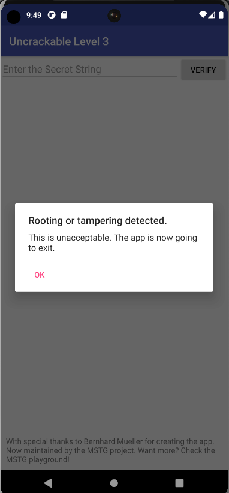
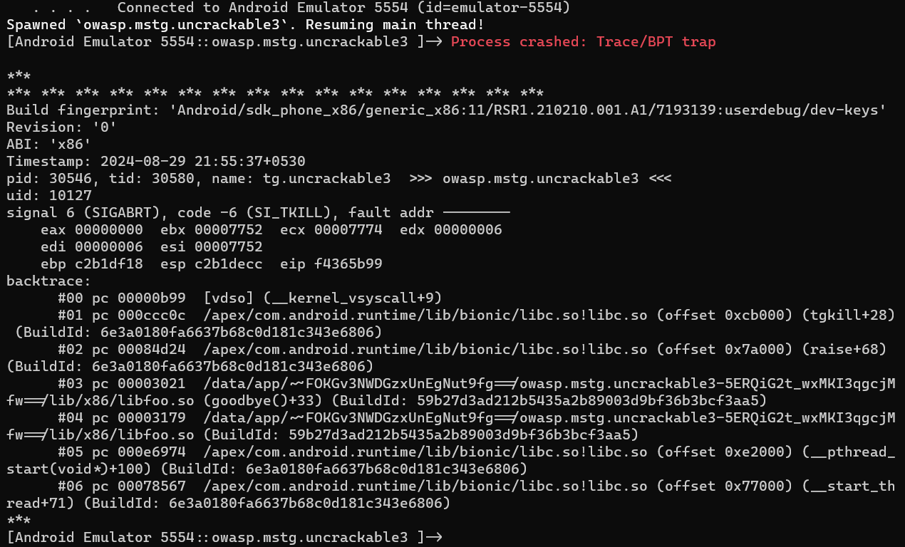
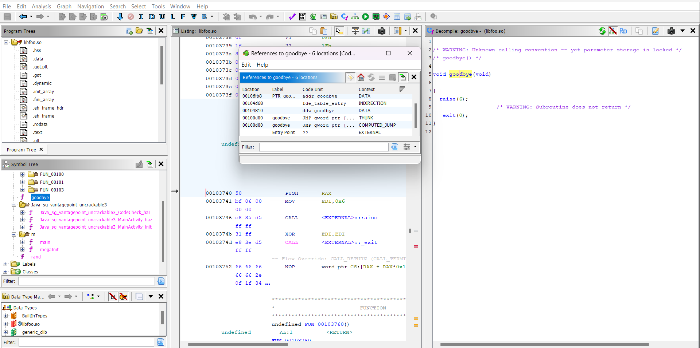
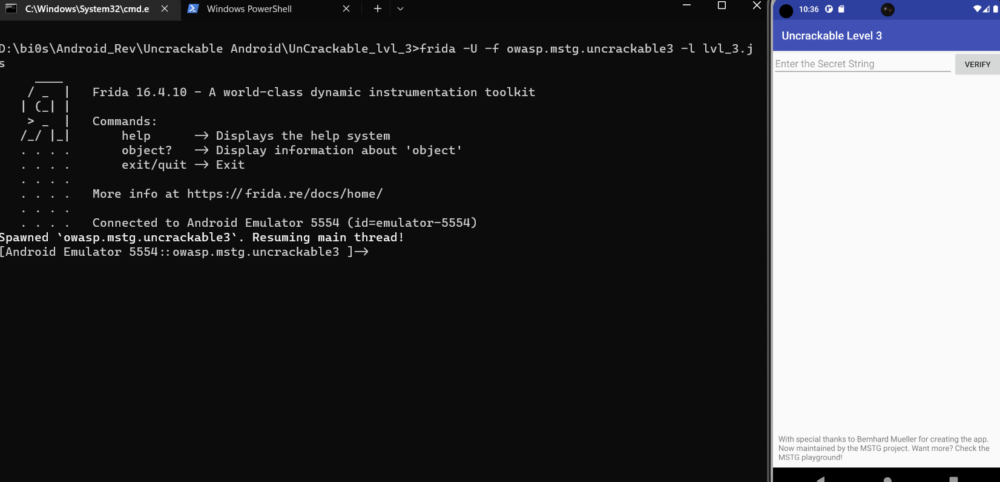

On trying to run the apk on emulator the same root detected page shows up.


Decompile the apk file using jadx-gui. Inside decompile all the classes under tools.
The same root detection is there in this app as the previous one. You can bypass it the same way as the previous one using `frida`.  Be sure to change the package name and class name accordingly. Check out the writeup for the previous app [here](https://irregular-25.vercel.app/posts/uncrackable-lvl-1/solution/).

Our initial root bypass code:-
```js
Java.perform(function(){
    let c = Java.use("sg.vantagepoint.util.RootDetection");
    c["checkRoot1"].implementation = function () {
        return false
    };

    c["checkRoot2"].implementation = function () {
        return false;
    };

    c["checkRoot3"].implementation = function () {
        return false;
    };
})
```

Start `frida-server` on the emulator and we run our initial bypass script using the command:
`frida -U -f owasp.mstg.uncrackable3 -l lvl3.js`

When this commands executes, the app starts for a while and then crashes and we get the following error message.

It is seen that the app crashes at `goodbye()+33` in `libfoo.so`. `libfoo.so` is a native library which is being called in the app.

```java
static {
        System.loadLibrary("foo");
    }
```
You can check it in the `MainActivity.java` in the package `sg.vantagepoint.uncrackable3` which is the starting point of the apk.

Decompile `libfoo.so` using ghidra(or any decompiler of your choice).



Click on the `goodbye` function and lets find out where is it getting called from.
Right click on the `goodbye` in the pseudocode and click `References -> Find References to goodbye` and we see the above screen.

It is clearly seen that there is a computed jump from `goodbye` itself. Click on that particular reference and a similar yet a slightly different pseudocode will appear.

Follow the same steps as above, the only difference this time being we will be searching the reference to the actual address of `goodbye` which is `0x00100d00`.

An `unconditional call` is done on the function. Click on that and we will be taken to the function and the place from where the apk starts to crash.

```c
void FUN_001037c0(void)
{
  FILE *__stream;
  char *pcVar1;
  long in_FS_OFFSET;
  pthread_t pStack_248;
  long lStack_240;
  char acStack_238 [520];
  
  lStack_240 = 0x1037e4;
  __stream = fopen("/proc/self/maps","r");
  if (__stream == (FILE *)0x0) {
LAB_0010386c:
    pcVar1 = "Error opening /proc/self/maps! Terminating...";
  }
  else {
    do {
      while( true ) {
        lStack_240 = 0x103820;
        pcVar1 = fgets(acStack_238,0x200,__stream);
        if (pcVar1 != (char *)0x0) break;
        lStack_240 = 0x10384f;
        fclose(__stream);
        lStack_240 = 0x103859;
        usleep(500);
        lStack_240 = 0x103864;
        __stream = fopen("/proc/self/maps","r");
        if (__stream == (FILE *)0x0) goto LAB_0010386c;
      }
      lStack_240 = 0x103830;
      pcVar1 = strstr(acStack_238,"frida"); // Hereeeeeeee
      if (pcVar1 != (char *)0x0) break;
      lStack_240 = 0x103840;
      pcVar1 = strstr(acStack_238,"xposed");
    } while (pcVar1 == (char *)0x0);
    pcVar1 = "Tampering detected! Terminating...";
  }
  lStack_240 = 0x103896;
  __android_log_print(2,"UnCrackable3",pcVar1);
  lStack_240 = 0x10389b;
  goodbye();
  lStack_240 = *(long *)(in_FS_OFFSET + 0x28);
  pthread_create(&pStack_248,(pthread_attr_t *)0x0,FUN_001037c0,(void *)0x0);
  Ram0000000000107050 = SUB169(ZEXT816(0),7);
  _DAT_00107040 = SUB169(ZEXT816(0),0);
  _DAT_00107049 = 0;
  DAT_0010705c = DAT_0010705c + 1;
  if (*(long *)(in_FS_OFFSET + 0x28) != lStack_240) {
                    /* WARNING: Subroutine does not return */
    __stack_chk_fail();
  }
  return;
}
```

This is the decompiled code. The most suspicious line here is `pcVar1 = strstr(acStack_238,"frida");`. `strstr` basically finds out the occurrence of a particular substring in a string and returns its position. This is what is causing the crash in out app. To bypass this, lets find out the location of the `strstr` by using Frida's API `findExportByName` which will find out address of the function from its library. It is known that all standard c functions reside in `libc.so`. We then use the `Interceptor` API to hook to the function and return `0` when the word `frida` occurs.
```js
Java.perform(function(){
    Interceptor.attach(Module.findExportByName("libc.so","strstr"), {
      onEnter: function(args){
        this.detectfrida = 0;
        if(args[0].readUtf8String().indexOf("frida") != -1){
          this.detectfrida = 1;
        }
        else{
          this.detectfrida = 0;
        }
      },
      onLeave: function(retval){
        if(this.detectfrida == 1){
          retval.replace(0);
        }
      }
    });
    
    let c = Java.use("sg.vantagepoint.util.RootDetection");
    c["checkRoot1"].implementation = function () {
        return false
    };

    c["checkRoot2"].implementation = function () {
        return false;
    };

    c["checkRoot3"].implementation = function () {
        return false;
    };

})
```

Lets try to load this code into our app.


Thus, we bypass the root and tamper checks.
